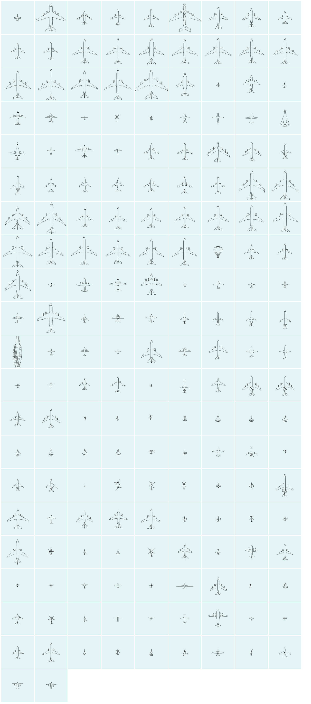

# AircraftShapesSVG

Aircraft shapes (Top View) for ADSB-Viewers in SVG-Format

amnesica and me created an own ADSB application [BelugaProject](https://github.com/amnesica/BelugaProject). In our app we use a lot of the concepts of [tar1090](https://github.com/wiedehopf/tar1090/tree/master/html) by wiedehopf and [dump1090](https://github.com/flightaware/dump1090) by flightaware. Maybe there are far more contributors. Ein ganz großes Dankeschön / a lot of thanks to all of you.

Time to give something back. We created new aircraft shapes or redesigned some existing ones and would like to share them here.

Besides you find a Manual for "Creating aircraft shapes in svg format". It describes our workflow and hopefully may help to increase the amount of aircraft shapes for tar1090, dump1090 (and BelugaProject).

