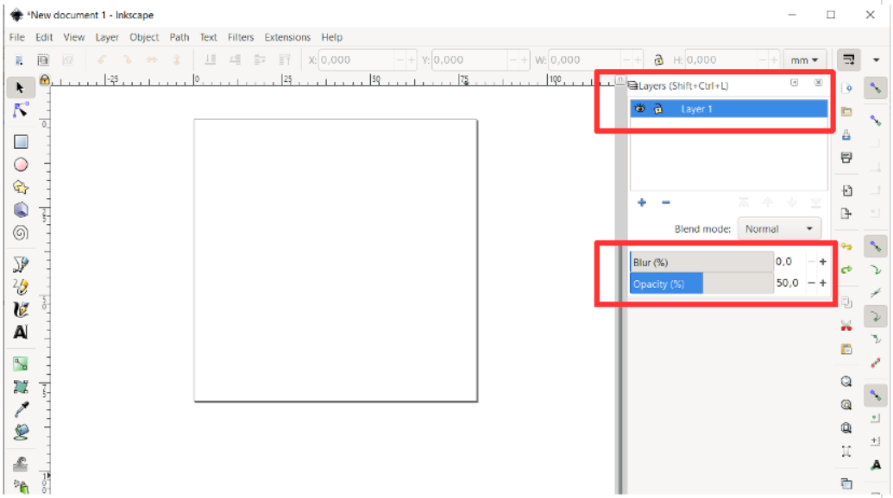
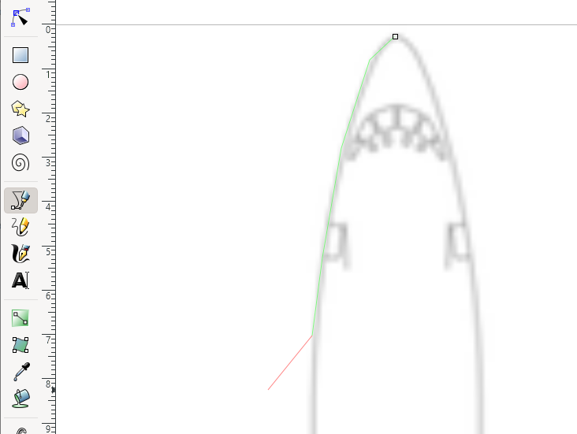
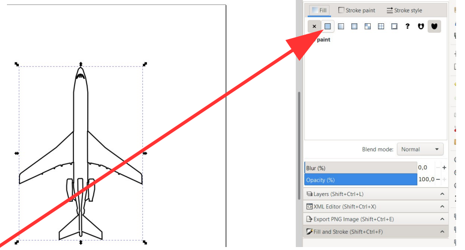
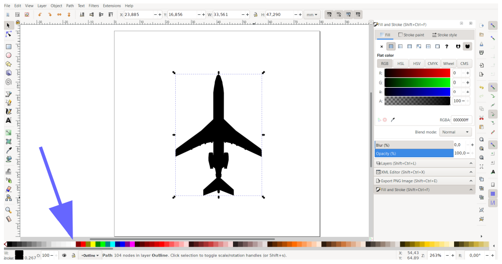

## Creating aircraft shapes in svg format (Tutorial)

by RexKramer1

<details>
<summary><b>Table of Contents</b> (click to open)</summary>
<!-- MarkdownTOC -->

- [Creating aircraft shapes in svg format (Tutorial)](#creating-aircraft-shapes-in-svg-format--tutorial-)
  - [Motivation](#motivation)
  - [Introduction](#introduction)
  - [Recommended Tools (Open Source)](#recommended-tools--open-source-)
    - [Inkscape](#inkscape)
    - [Gimp](#gimp)
    - [Texteditor](#texteditor)
  - [Preparations](#preparations)
  - [Drawing the aircraft shape with Inkscape](#drawing-the-aircraft-shape-with-inkscape)
    - [Setting Document Properties](#setting-document-properties)
    - [Create Layer „Background Image“](#create-layer--background-image-)
    - [Add Layer „Outline“](#add-layer--outline-)
    - [Add Layer „Accent“](#add-layer--accent-)
    - [Create svg-file](#create-svg-file)
    - [Read out parameters for use in tar1090](#read-out-parameters-for-use-in-tar1090)
    - [Export svg to png](#export-svg-to-png)
  - [Add new aircraft shape to BelugaProject](#add-new-aircraft-shape-to-belugaproject)
    - [Adding shape to Database belugaDb](#adding-shape-to-database-belugadb)
    - [Adding shape to Database BelugaProjectSprites.png](#adding-shape-to-database-belugaprojectspritespng)
    - [Calculate PNG-Scale](#calculate-png-scale)

<small><i><a href='http://ecotrust-canada.github.io/markdown-toc/'>Table of contents generated with markdown-toc</a></i></small>

<!-- /MarkdownTOC -->
</details>

### Motivation

amnesica and me created an own ADSB application [BelugaProject](https://github.com/amnesica/BelugaProject). In our app we use a lot of the concepts of [tar1090](https://github.com/wiedehopf/tar1090/tree/master/html) by wiedehopf and [dump1090](https://github.com/flightaware/dump1090) by flightaware. Maybe there are far more contributors. Ein ganz großes Dankeschön ( a lot of thanks) to all of you.

Time to give something back. We created new aircraft shapes and redesigned some existing ones and would like to share them [here](https://github.com/RexKramer1/AircraftShapesSVG).

We hope that there will be other aviation and adsb fans, who would like to create new aircraft shapes for the community. This tutorial is for them. It describes our workflow and hopefully may help to increase the amount of aircraft shapes for tar1090, dump1090 (and BelugaProject).

### Introduction

To add new aircraft shapes to [tar1090](https://github.com/wiedehopf/tar1090/tree/master/html), [dump1090](https://github.com/flightaware/dump1090) or [BelugaProject](https://github.com/amnesica/BelugaProject) it is required to define one or two „path“-variables and some additional parameters.

A look into the tar1090 file [markers.js](https://github.com/wiedehopf/tar1090/blob/master/html/markers.js) shows the structure of an aircraft shape:

```
…
// Mac Donnell-Doulgas A4 Skyhawk (ICAO A4)
'md_a4': {
viewBox:'-4.2 -1 32 32',
id: 26,
w: 26,
h: 26,
accentMult: 0.8,
strokeScale: 1.1,
path: 'M11.7 26.5H8v-.7s0-.3.3-.6l2.6-2.4s-.2-1-.3-4H3v-2.4l.3-.6 6.3-5.5.2-1.3s.3-.2.6-.1V7.8s0-.2.2 0c0 0 0-3.5.5-6.2 0 0 .3-1.2.7-1.2.4 0 .7 1.2.7 1.2.5 2.7.5 6.2.5 6.2 0-.2.2 0 .2 0v1l.6.2.2 1.3 6.3 5.5c.3.4.2.6.2.6v2.3h-7.4c-.1 3-.3 4-.3 4l2.6 2.5c.3.3.3.6.3.6v.7H12l-.1.5-.2-.5z',
accent: 'M9.7 20.4l.9-1.7-1-8.4-.9-1.4M14 20.4l-.8-1.7.9-8.4 1-1.4',
},
…
```

**"path"** contains the outline of the aircraft, a polygon which is filled with different coulors at runtime, depending on the altitude of the aircraft:

<p align="center"> 

Parameter **"strokeScale"** controls the thickness of our lines in **"path"**.

**"accent"** contains some lines, which will be put on top of the (filled) aircraft polygon at runtime:

<p align="center"> 

Parameter **"accentMult"** controls the thickness of our lines in **"accent"**.

**"path"** has to be „closed“ to be an outline, **"accent"** can be a collection of single lines.

Parameters **„w“** (width) and **„h“** (height) define the size of the aircraft shape.

Parameter **"viewBox"** defines the size of the canvas (here 32 x 32 units)., where we put our aircraft shape on and the position of the shape (X = -4.2 / Y= -1) on our canvas:

<p align="center"> 

**„id“** is a unique identifier for the aircraft shape. It is used in tar1090, when the aircraft is drawn from a png-file instead of svg-file. You will find a description to extend this png-file in chapter [Export svg to png](#Export-svg-to-png).

### Recommended Tools (Open Source)

#### Inkscape

[Inkscape](https://inkscape.org/) is recommended for drawing the shapes. This manual describes how to use it for editing of aircraft shapes.

#### Gimp

[Gimp](https://www.gimp.org/) is recommended for creating or editing the png-File.

#### Texteditor

I am using [Notepad++](https://notepad-plus-plus.org/), but any other plain text editor will do.

### Preparations

In this tutorial I will show how to create an aircraft shape for the Boeing 727-200.

Get a technical drawing of the desired aircraft, which shows the aircraft from top. I will use this one from commons.wikimedia.org:

<p align="center"> 

Source: https://commons.wikimedia.org/wiki/File:B727FAMILYv1.0.png

Find out its dimensions (lenght and width) in the web. Search wikipedia or try to find it for example here in the Aircraft Performance Datbase from Eurocontrol:
https://contentzone.eurocontrol.int/aircraftperformance/default.aspx?

The dimensions for the Boeing 727-200 are
lenght = 46.68 meters
width = 32.92 m (Wingspan)
(taken from https://en.wikipedia.org/wiki/Boeing_727#Specifications)

Because I use it as filename for the new svg-file, I get the ICAO-Typedesignator for my aircraft from here:
https://www.icao.int/publications/DOC8643/Pages/Search.aspx

Typedesignator for the Boeing 727-200 is **B722**.

### Drawing the aircraft shape with Inkscape

#### Setting Document Properties

Setup our canvas in _Menu File / Document Properties_:

<p align="center"> 

I take these values because they allow easy scaling of our aircraft shapes – 1 mm for 1 meter in real life. Aircraft dimensions fit well, because most aircraft are smaller than 80 meters width x 80 meters length.

#### Create Layer „Background Image“

_Menu Layer / Layers …_

Rename Layer „Layer1“ to „Background Image“ and set Opacity to 50%, select the attributes by clicking into the marked fields:

<p align="center"> 

Opacity 50% will allow us comfortable painting on top of our drawing later.

Save Document as `B722 with Bitmap.svg`.

Copy and Paste aircraft drawing:

<p align="center"> 

To rotate the drawing use _Menü Object / Rotate CW_:

<p align="center"> 

To adjust the size of Background Image, click on the lower right corner and press CTRL, then resize the drawing with left Mouse-button to make it fit into the canvas:

<p align="center"> 

Drag the drawing and line up the aircraft exactly to the left upper corner of the canvas:

<p align="center"> 

Resize the canvas with CTRL+ Mousewheel and move it, so that it looks like this:

<p align="center"> 

Note the ruler above the drawing. We use the top ruler to resize the width of our drawing.

Remember: the original dimensions for the Boeing 727-100 are
lenght = 46.68 meters,
width = 32.92 m (Wingspan)

Now we adjust the size of our drawing to reach the wingspan (in mm):

<p align="center"> 

If you put the cursor on the right wing tip of our Boeing (red arrow), you can read out the exact width by the black marker on the ruler (blue arrow). Of course this only works if you have lined up the aircraft properly on the left and top side.

If our drawing is right-scaled, the height has to be approximately 46.68 mm. We can read that out on the left side ruler.

Save file with CTRL+S.

#### Add Layer „Outline“

_Menu Layer / Add Layer …_

<p align="center"> 

Now draw the outline path on this layer.
Use the tool „Draw Bezier Curves and straight lines“ from the left toolbar:

<p align="center"> 

Zoom in (+) and use scrollbars to reach desired draw position.
Try to draw the outline complete and do not interrupt.
Begin drawing at top of the aircraft and proceed drawing point for point.

<p align="center"> 

While drawing you can use mousewheel and CTRL+Mousewheel to zoom in and out or use scrollbars to move the window. If a point is wrong, use CTRL+Z for Undo …
Finally „close“ your path, i.e. connect the last point with the start point (it has to snap in).

<p align="center"> 

With this tool you can show the points of your outline path (your outline path must be selected):

<p align="center"> 

You can move the points for adjustments and corrections. If points snap in to something and can not be moved to a desired new position, then use this button to deactivate „snap in“:

<p align="center"> 

#### Add Layer „Accent“

_Menu Layer / Add Layer …_

<p align="center"> 

Now draw the accent lines on this layer.
Use the tool „Draw Bezier Curves and straight lines“ from the left toolbar:

<p align="center"> 

Zoom in (+) and use scrollbars to reach desired draw position.

We begin with the cockpit. On the accent layer lines must not be closed. Therefore we can draw the cockpit windows separately. We begin with the left side windows:

<p align="center"> 

We select the objects, copy them to clipboard (CTRL-C) and paste them with CTRL-V:

<p align="center"> 

The selected objects can be rotated with _Menu Object / Flip Horizontal_:

<p align="center"> 

The copied cockpit windows can be moved to the left side of the cockpit section:

<p align="center"> 

Now we proceed with the fuselage line above the left wing:

<p align="center"> 

We repeat this with the right side and continue with the rear of our Tri-Jet:

<p align="center"> 

Finally our aircraft looks like this:

<p align="center"> 

Now switch off visibility for layers „Background Image“ and „Outline“ by clicking the „eye“-symbol (red arrow) in front of the layers:

<p align="center"> 

Select all lines on this layer with _Menu Edit / Select All_.
Then „combine“ all lines (on this layer „Accent“) as a single path with _Menu Path / Combine_:

<p align="center"> 

Important: We have to set „Scale proportionally“ for the combined path with _Menu Object / Transform …_

<p align="center"> 

Select „Scale proportionally“ and press button „Apply“.

Make layers „Background Image“ and „Outline“ visual again by clicking the „eye“-symbol in front of the layers.

<p align="center"> 

Change Viewbox to center the aircraft shape on the canvas with _Menu File / Document Properties …_

<p align="center"> 

Formula for centering in canvas:

X = Round(canvas-width – aircraft-width) /2 \* -1

Y = Round(canvas-height – aircraft-length) /2 \* -1

X = Round(80 mm – 32.92 mm)/2 ) \* -1 = -24

Y = Round(80 mm – 46.68 mm)/2 ) \* -1 = -17

Save file with CTRL-S.
Our source-file `B722 with Bitmap.svg` is now done.

#### Create svg-file

Select Layer „Background Image“ and delete it by pressing the „Minus“-Button.

<p align="center"> 

Save file **as a copy** (important!) with filename `B722.svg`.

#### Read out parameters for use in tar1090

Open an editor and create a new file with this text (please copy text from here):

```
// Mac Donnell-Doulgas A4 Skyhawk (ICAO A4)
'md_a4': {
viewBox:'-4.2 -1 32 32',
id: 26,
w: 26,
h: 26,
accentMult: 0.8,
strokeScale: 1.1,
path: 'M11.7 26.5H8v-.7s0-.3.3-.6l2.6-2.4s-.2-1-.3-4H3v-2.4l.3-.6 6.3-5.5.2-1.3s.3-.2.6-.1V7.8s0-.2.2 0c0 0 0-3.5.5-6.2 0 0 .3-1.2.7-1.2.4 0 .7 1.2.7 1.2.5 2.7.5 6.2.5 6.2 0-.2.2 0 .2 0v1l.6.2.2 1.3 6.3 5.5c.3.4.2.6.2.6v2.3h-7.4c-.1 3-.3 4-.3 4l2.6 2.5c.3.3.3.6.3.6v.7H12l-.1.5-.2-.5z',
accent: 'M9.7 20.4l.9-1.7-1-8.4-.9-1.4M14 20.4l-.8-1.7.9-8.4 1-1.4',
},
```

Within the next steps we will fill or change the marked text/variables.

<p align="center"> 

Change description to `Boeing 727-200 (ICAO B722)` and shape name `md_a4` to `B722`.
Change **„h“** and **„w“** from value **„26“** to **„80“** (the height and width of our canvas).

Go back to Inkscape.
Open XML-Editor with _Menu Edit / XML-Editor …_

<p align="center"> 

Go to XML-Editor, scroll down to XML-Element with label **„Outline“**, click on the small arrow left side, this opens the path-Element in this layer:

<p align="center"> 

A click on column **„Value“** at element **„d“** shows the complete path:

<p align="center"> 

Right-click into the path, choose „Select All“ and then „Copy“. Now the path is in clipboard.
Go back to Editor, paste path from clipboard exactly like this:

<p align="center"> 

Go back to Inkscape.
Change layer to **„Accent“**:

<p align="center"> 

Open XML-Editor.
Scroll down to XML-Element with label **„Accent“**, click on the small arrow left side, this opens the path-Element in this layer. A click on column **„Value“** at element **„d“** shows the complete path:

<p align="center"> 

Right-click into the path, choose „Select All“ and then „Copy“. Now the path is in clipboard.
Go back to Editor, paste path from clipboard exactly like this:

<p align="center"> 

Go back to Inkscape.
Open „Document Properties“ with Shift+CTRL+D:

<p align="center"> 

Copy the Values in Viewbox … (-24 -17 80 80) to our XML-Code in Editor:

```
// Boeing 727-200 (ICAO B722)
'B722': {
viewBox:'-24 -17 80 80',
id: 78,
w: 80,
h: 80,
accentMult: 0.8,
strokeScale: 1.1,
path: 'M 16.610292,0.03830042 16.038785,0.57734283 15.395842,2.5897676 14.967213,5.0873309 14.735024,6.8661698 V 17.467336 l -4.7685025,4.474051 -9.55486516,6.971614 -0.28574275,0.359361 -0.10716887,0.341397 v 2.174136 L 6.0552782,29.002842 6.1624471,29.18251 h 0.1071688 l 0.053585,-0.341405 3.0182664,-1.383545 0.089287,0.197635 h 0.1428714 l 0.089287,-0.359372 1.1430103,-0.539042 0.535786,-0.08983 0.03574,0.323438 h 0.232189 l 0.116094,-0.404277 2.080637,-0.440218 0.116095,0.350369 h 0.25004 l 0.05358,-0.467171 0.526857,-0.0449 0.01779,5.516198 -0.348262,-0.02711 -0.01779,-0.682788 -0.160753,-0.323437 -1.062643,0.009 -0.214307,0.278503 -0.125021,1.554236 0.01779,1.212843 0.607225,2.542488 0.05358,0.485138 0.884051,-0.03579 -0.02668,-0.521076 0.142871,-0.206635 0.884048,0.682783 0.366123,1.976492 -0.160755,0.494122 0.16968,0.889419 0.267892,0.431235 -5.214993,4.671696 0.0089,2.021412 5.500744,-2.093283 0.01779,0.95231 0.223233,0.278503 h 0.223233 l 0.187529,-0.269537 -0.0089,-1.060118 5.473955,2.147186 -0.02669,-2.021408 -5.214992,-4.617796 0.383981,-0.458188 0.08036,-0.907387 -0.187531,-0.449201 0.401841,-2.012425 0.955487,-0.69177 0.116094,0.206635 v 0.557009 l 0.866188,-0.009 v -0.440218 l 0.285743,-1.114019 0.330402,-1.724938 -0.0089,-1.266747 -0.116095,-1.149959 -0.223232,-0.332403 -1.035855,0.009 -0.196456,0.179667 -0.0089,0.700754 -0.285742,0.009 0.02669,-5.363474 0.375051,0.08087 0.116094,0.314437 0.25004,0.0449 0.03574,-0.314437 2.223518,0.485135 0.02669,0.332403 0.276817,0.03579 0.08036,-0.305471 0.464347,0.07187 1.143015,0.539039 0.06251,0.323438 0.214308,0.0449 0.08036,-0.206635 2.928967,1.365574 0.06251,0.341405 0.18753,0.0449 0.09824,-0.206636 6.081183,2.820986 L 33.2642,29.559667 33.148224,29.155303 32.90711,28.894767 23.316524,21.93214 18.57481,17.377231 18.5926,6.9916804 18.396145,5.0690966 17.985372,2.8769899 17.217413,0.59504569 Z',
accent: 'm 16.914261,44.58071 -0.03773,-5.00511 -0.08803,-0.364697 0.113181,-1.886349 0.352118,-3.634364 -0.0503,-3.15649 -0.163484,-0.188635 -1.031204,0.02516 m 0.06288,-0.03774 -0.213787,0.238937 0.0503,3.143914 0.352118,3.508608 0.113181,1.936652 -0.113181,0.515602 0.02515,4.86678 m 2.489985,-13.217017 -0.03773,1.949228 0.07545,1.546804 -0.03773,0.779693 m -0.326957,-4.300876 -0.03773,1.496504 -0.603632,3.533759 m -3.106184,-4.891931 0.03773,1.30787 0.616207,3.596637 m -0.99348,-4.979961 0.07545,1.886349 -0.02515,1.534229 -0.100604,1.01863 m 4.187696,-18.410763 0.02515,8.664628 m -3.860724,-8.551447 0.02515,8.526297 M 17.120105,2.1340449 c -0.05659,0.081742 -0.132044,0.2892402 -0.132044,0.2892402 m -0.140832,0.290957 -0.09432,-0.050302 4e-6,0.069166 0.09432,0.012576 z m 0.792267,0.37727 -0.144624,-0.4590117 -0.333255,-0.5344654 -0.440149,-0.1509079 -0.0063,0.3709819 0.282953,0.1131809 0.276665,0.2326496 0.232649,0.414997 z M 16.052828,2.131575 c 0.05659,0.081742 0.132044,0.2892402 0.132044,0.2892402 m 0.138333,0.2955278 0.09432,-0.050302 -4e-6,0.069166 -0.09432,0.012576 z m -0.792267,0.3772699 0.144624,-0.4590116 0.333255,-0.5344654 0.440149,-0.1509079 0.0063,0.3709819 -0.282953,0.1131809 -0.276665,0.2326496 -0.232649,0.4149969 z',
},
```

Important: the new aircraft shape B722 has to be assigned in „TypedesignatorIcons“ in markers.js. Search for „B722“ and find:

<p align="center"> 

This assignment has to be changed to

```
'B722': ['B722', 1.10], // 80t
```

Maybe it is required to change the scale factor 1.10, too.

There is only one task left: our B722 needs a unique **id**. We set this value to **78**. This parameter is explained at the end of the next chapter.

#### Export svg to png

Tar1090 has a webGL-Mode. When active (default), tar1090 does not use the svg-data (path, accent etc.) from `markers.js`, instead a PNG-file `sprites010.png` is used:

<p align="center"> 

Source: https://github.com/wiedehopf/tar1090/blob/master/html/images/sprites010.png

`sprites010.png` contains a matrix of shapes, each with a size of 72px \* 72px. We have to add our B722-shape to this matrix.

The first step is to export `B722.svg` to `B722.png`.

Open `B722.svg` in Inkscape.
Select layer „Outline“.
Select all with CTRL+A.
Select _Menu Object / Fill and Strike …_

<p align="center"> 

Press Button „Flat color“. Default fill color is „black“, we change the color to „white“ (press „color-button“ marked with the blue arrow).

<p align="center"> 

Fill color changes to „white“:

<p align="center"> 

Do **not** (!) save file!

Select _All in All layers_ with CTRL+ALT+A.
Open Export-command with _Menu File / Export PNG-Image ..._

<p align="center"> 

Set Image Size:
To maximize our shape in a box of 72px \* 72px we change the one of the values **width** or **height** to **72** which is greater than the other. For our B722 we change **„Height“** from **85** to **72**, and Inkscape adjusts **„Width“** automatically to **51**.

Set Filename: replace „path90.png“ with „B722.png“.

<p align="center"> 

Do not forget to press button „Export“, otherwise nothing will happen.

Do **not** (!) save file, instead revert all changes with _Menu File / Revert_.

Make a backup of file `sprites010.png`.

Open GIMP.

Inside GIMP open File `sprites010.png`

<p align="center"> 

Open Preferences and set „Default Grid“ like this:

<p align="center"> 

Apply Grid with _Menu View / Show Grid_:

<p align="center"> 

Now open `B722.png`.

Select complete image with CTRL+A.

Copy image to clipboard with CTRL+C.

Switch to File `sprites010.png`.

Select the next empty cell with your mouse (size of selection must be 72px \* 72px):

<p align="center"> 

Paste the image from clipboard into the selected cell (_Menu Edit / Paste Into Selection_):

<p align="center"> 

Save File `sprites010.png` with _Menu File / Overwrite sprites010.png_.

Now we can set the id. It must match with the position of the B722 on the sprite. We add 1 to the value of the „strato“, which has id = 77.

The id for B722 in this example is 78.

### Add new aircraft shape to BelugaProject

#### Adding shape to Database belugaDb

In [BelugaProject](https://github.com/amnesica/BelugaProject) the svg-code is in a postgresql database table „shape_data“. Postgresql offers an adminstration tool „pgAdmin“. This tool allows to edit the content of tables. Navigate to table „shape data“ and use the command View/Edit Data …:

<p align="center"> 

Select a row and press the copy-Button, then the Insert-Button:

<p align="center"> 

The result is a new row with the copied content at the end of the table:

<p align="center"> 

Change the attributes for B722: doubleclick into each field, then edit the field content.

<p align="center"> 

Save changes with this button:

<p align="center"> 

The column „shape data“ contains the JSON-Code from the svg-file.
The structure in Beluga Project is similar to tar1090:

```
{ "h": 80,
"w": 80,
"path":
"",
"accent":
"",
"viewBox": "0 0 80 80",
"accentMult": 1.0,
"strokeScale": 1.0
}
```

Open an text editor, copy this JSON-snippet into a file and replace the values in the same way as described for tar1090 before.

The result should be:

```
{ "h": 80,
"w": 80,
"path":
"M 16.610292,0.03830042 16.038785,0.57734283 15.395842,2.5897676 14.967213,5.0873309 14.735024,6.8661698 V 17.467336 l -4.7685025,4.474051 -9.55486516,6.971614 -0.28574275,0.359361 -0.10716887,0.341397 v 2.174136 L 6.0552782,29.002842 6.1624471,29.18251 h 0.1071688 l 0.053585,-0.341405 3.0182664,-1.383545 0.089287,0.197635 h 0.1428714 l 0.089287,-0.359372 1.1430103,-0.539042 0.535786,-0.08983 0.03574,0.323438 h 0.232189 l 0.116094,-0.404277 2.080637,-0.440218 0.116095,0.350369 h 0.25004 l 0.05358,-0.467171 0.526857,-0.0449 0.01779,5.516198 -0.348262,-0.02711 -0.01779,-0.682788 -0.160753,-0.323437 -1.062643,0.009 -0.214307,0.278503 -0.125021,1.554236 0.01779,1.212843 0.607225,2.542488 0.05358,0.485138 0.884051,-0.03579 -0.02668,-0.521076 0.142871,-0.206635 0.884048,0.682783 0.366123,1.976492 -0.160755,0.494122 0.16968,0.889419 0.267892,0.431235 -5.214993,4.671696 0.0089,2.021412 5.500744,-2.093283 0.01779,0.95231 0.223233,0.278503 h 0.223233 l 0.187529,-0.269537 -0.0089,-1.060118 5.473955,2.147186 -0.02669,-2.021408 -5.214992,-4.617796 0.383981,-0.458188 0.08036,-0.907387 -0.187531,-0.449201 0.401841,-2.012425 0.955487,-0.69177 0.116094,0.206635 v 0.557009 l 0.866188,-0.009 v -0.440218 l 0.285743,-1.114019 0.330402,-1.724938 -0.0089,-1.266747 -0.116095,-1.149959 -0.223232,-0.332403 -1.035855,0.009 -0.196456,0.179667 -0.0089,0.700754 -0.285742,0.009 0.02669,-5.363474 0.375051,0.08087 0.116094,0.314437 0.25004,0.0449 0.03574,-0.314437 2.223518,0.485135 0.02669,0.332403 0.276817,0.03579 0.08036,-0.305471 0.464347,0.07187 1.143015,0.539039 0.06251,0.323438 0.214308,0.0449 0.08036,-0.206635 2.928967,1.365574 0.06251,0.341405 0.18753,0.0449 0.09824,-0.206636 6.081183,2.820986 L 33.2642,29.559667 33.148224,29.155303 32.90711,28.894767 23.316524,21.93214 18.57481,17.377231 18.5926,6.9916804 18.396145,5.0690966 17.985372,2.8769899 17.217413,0.59504569 Z",
"accent":
"m 16.914261,44.58071 -0.03773,-5.00511 -0.08803,-0.364697 0.113181,-1.886349 0.352118,-3.634364 -0.0503,-3.15649 -0.163484,-0.188635 -1.031204,0.02516 m 0.06288,-0.03774 -0.213787,0.238937 0.0503,3.143914 0.352118,3.508608 0.113181,1.936652 -0.113181,0.515602 0.02515,4.86678 m 2.489985,-13.217017 -0.03773,1.949228 0.07545,1.546804 -0.03773,0.779693 m -0.326957,-4.300876 -0.03773,1.496504 -0.603632,3.533759 m -3.106184,-4.891931 0.03773,1.30787 0.616207,3.596637 m -0.99348,-4.979961 0.07545,1.886349 -0.02515,1.534229 -0.100604,1.01863 m 4.187696,-18.410763 0.02515,8.664628 m -3.860724,-8.551447 0.02515,8.526297 M 17.120105,2.1340449 c -0.05659,0.081742 -0.132044,0.2892402 -0.132044,0.2892402 m -0.140832,0.290957 -0.09432,-0.050302 4e-6,0.069166 0.09432,0.012576 z m 0.792267,0.37727 -0.144624,-0.4590117 -0.333255,-0.5344654 -0.440149,-0.1509079 -0.0063,0.3709819 0.282953,0.1131809 0.276665,0.2326496 0.232649,0.414997 z M 16.052828,2.131575 c 0.05659,0.081742 0.132044,0.2892402 0.132044,0.2892402 m 0.138333,0.2955278 0.09432,-0.050302 -4e-6,0.069166 -0.09432,0.012576 z m -0.792267,0.3772699 0.144624,-0.4590116 0.333255,-0.5344654 0.440149,-0.1509079 0.0063,0.3709819 -0.282953,0.1131809 -0.276665,0.2326496 -0.232649,0.4149969 z",
"viewBox": "-24 -17 80 80",
"accentMult": 1.0,
"strokeScale": 1.0
}
```

Now copy all this code to clipboard and paste it into the database table shape data, column shape_data:

<p align="center"> 

Save changes with F6.

Similar to tar1090 the new shape has to be assigned to a typedesignator. This is done in Database table map_type_to_shape:

<p align="center"> 

We have to change the attribute „shape_designator“ from the default value „JET_swept“ to „B722“.
Save changes with F6.

#### Adding shape to Database BelugaProjectSprites.png

BelugaProject use a Sprites.png-file, too. But it is bigger than in tar1090:

<p align="center"> 

Adding a new shape is done the same way as for tar1090.

Open `BelugaProjectsprites.png` in GIMP.

Turn on grid with 72px \* 72px.

Open `B722.png`.

Select All (CTRL+A)

Copy to clipboard (CTRL+C)

Go to Window with `BelugaProjectSprites.png`

Select next free cell (size of selection = 72px \* 72px)

<p align="center"> 

_Menu Edit / Paste Into Selection_

<p align="center"> 

#### Calculate PNG-Scale

All shapes are maximized into the 72x72 pixel box to preserve all details. A small Cessna would be as big as a B747. To avoid this effect there is a PNG scale factor for adjusting the shape to a realistic size.

The Formula is:

PNG-Scale = MAX(length,width) / 72px

with

length of aircraft (46.68 mm) and
width of aircraft (32.92 mm)

= 46.68 / 72 = 0.65

The calculated PNG-scale has to be fine tuned during test.
